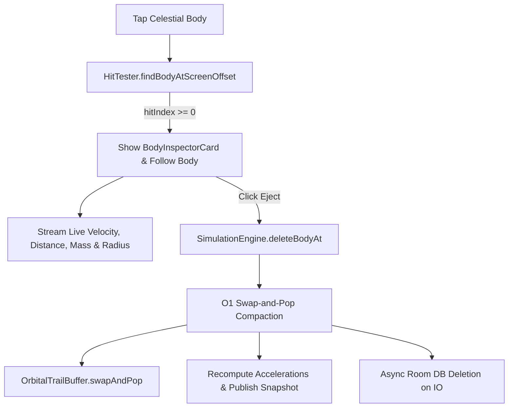

# Solar System Automata - Celestial Body Telemetry Inspector
**Branch**: `feature/body-inspector`  
**Base Commit**: `81d6a3f` (Milestone 2 merged into `main`)  
**Status**: Milestone 4 Completed & Verified  
**Tracked For**: Gemini Vibe Coding Sync  

---

## 1. Feature Map & Architectural Summary
1. **Zero-Allocation Telemetry Streaming**:
   - `RenderSnapshot` augmented with flat primitive arrays: `velX: DoubleArray`, `velY: DoubleArray`, and `mass: DoubleArray`.
   - Populated via native `System.arraycopy` during triple-buffer publication.
   - UI reads real-time velocity magnitude ($|\vec{v}| = \sqrt{v_x^2 + v_y^2}$), distance to origin ($r = \sqrt{x^2 + y^2}$), mass ($M_\oplus$), and radius ($R_\oplus$) completely wait-free and allocation-free.

2. **Sci-Fi Glassmorphic Inspector Card (`BodyInspectorCard.kt`)**:
   - Translucent gradient surface with subtle glowing border anchored at bottom-start (avoiding bottom deck overlap).
   - **Header**: Body color dot, name, classification chip (STAR, GAS GIANT, TERRESTRIAL, ASTEROID), and dismiss button.
   - **Metrics Grid**: Real-time velocity readout (AU/s), distance from barycenter (AU), mass ($M_\oplus$), and radius ($R_\oplus$).
   - **Action Deck**:
     - `[Track / Lock]`: Toggles camera follow mode on the inspected body.
     - `[Eject]`: Deletes the body via atomic $O(1)$ swap-and-pop compaction.

3. **$O(1)$ Swap-and-Pop Deletion (`SimulationEngine.deleteBodyAt`)**:
   - Replaces deleted body index with the last active body (`count - 1`).
   - Decrements count and zeroes vacated memory slot.
   - Recomputes pairwise accelerations immediately.
   - Synchronizes camera tracking and `OrbitalTrailBuffer.swapAndPop`.
   - Dispatches async Room deletion on `Dispatchers.IO`.

---

## 2. Mathematical Formulations & Invariants

### Scalar Telemetry Metrics
$$|\vec{v}| = \sqrt{v_x^2 + v_y^2}\,\text{AU/s}$$
$$r = \sqrt{x^2 + y^2}\,\text{AU}$$

### Classification Boundaries
$$\text{Class} = \begin{cases}
\text{STAR} & M \ge 1000.0\,M_\oplus \\
\text{GAS GIANT} & 10.0 \le M < 1000.0\,M_\oplus \\
\text{TERRESTRIAL} & 0.01 \le M < 10.0\,M_\oplus \\
\text{ASTEROID} & M < 0.01\,M_\oplus
\end{cases}$$

---

## 3. Test Suite & Verification Results
- `BodyInspectorTest`:
  - `testRenderSnapshot_copiesVelocitiesAndMass`: PASSED.
  - `testSimulationEngine_deleteBodyAt_performsSwapAndPop`: PASSED.
  - `testTelemetryCalculations_speedAndDistance`: PASSED.
- Pre-existing suites (`ScenarioPresetsTest`, `CollisionPhysicsTest`, `OrbitalIntegratorTest`, `SlingshotStateTest`, `HitTesterTest`, `CameraStateTest`, `OrbitalTrailBufferTest`, `CelestialBodyTest`): ALL PASSED.
- `./gradlew testDebugUnitTest`: BUILD SUCCESSFUL (all 9 suites green).
- `./gradlew assembleDebug`: BUILD SUCCESSFUL.
