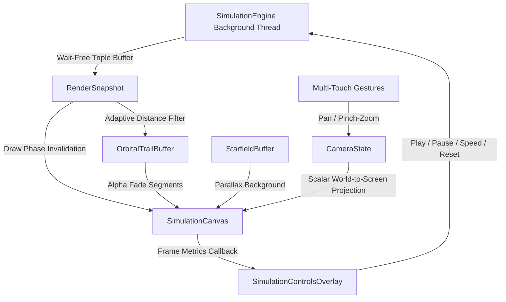

# Solar System Automata - Canvas Rendering & Camera Viewport
**Branch**: `feature/canvas-rendering`  
**Base Commit**: `948f2e9`  
**Status**: Completed & Verified  
**Tracked For**: Gemini Vibe Coding Sync  

---

## 1. Executive Summary & Architecture
We have successfully connected `SimulationEngine.getRenderSnapshot()` to a zero-allocation, hardware-accelerated Jetpack Compose Canvas rendering pipeline.

---

## 2. Key Engineering Invariants & Zero-Allocation Strategy

### A. Strict Draw-Phase Invalidation (Bypassing Recomposition)
- **Problem**: Recomposing Jetpack Compose trees on every frame tick (60 or 120 times/sec) causes massive GC pressure, CPU consumption, and frame drops.
- **Solution**: The frame ticker (`withFrameNanos`) is observed strictly inside `DrawScope` in `SimulationCanvas.kt`.
- **Result**: Frame updates call `invalidateLayer()` on the canvas node only, completely skipping Compose Recomposition and Layout phases.

### B. Zero Allocations in the Hot Draw Loop
- Pre-allocated `SimulationPaintCache` containing pre-configured `android.graphics.Paint` instances (`bgPaint`, `bodyPaint`, `haloPaint`, `trailPaint`, `labelPaint`, `labelShadowPaint`).
- Celestial coordinates are projected using scalar primitive math on `Float` and `Double`. No temporary `Offset` or `PointF` objects are allocated during drawing.
- Planet labels are rendered via `nativeCanvas.drawText()` using pre-hydrated `Array<String>` names from `RenderSnapshot`.

### C. Astronomical Coordinate System & Focal-Point Invariant Zoom
- 64-bit IEEE 754 precision (`Double`) preserves real astronomical scale coordinates ($10^{11}$ meters) without precision loss.
- Centroid-invariant zoom ensures that the point in world space directly underneath the user's fingers does not shift on screen while pinching to zoom:
  $$\text{centerX}_{\text{new}} = W_x - \frac{C_x - \frac{\text{viewportWidth}}{2}}{\text{zoom}_{\text{new}}}$$
  $$\text{centerY}_{\text{new}} = W_y - \frac{C_y - \frac{\text{viewportHeight}}{2}}{\text{zoom}_{\text{new}}}$$

### D. Zero-Allocation Circular Trail Buffer (`OrbitalTrailBuffer.kt`)
- Flat `DoubleArray` ring buffers of static capacity (`maxBodies * trailCapacity`).
- Stores 64-bit astronomical world coordinates so that panning or zooming the camera does not distort or displace past orbital paths.
- Dynamic distance threshold: only records points when distance exceeds screen-space resolution threshold ($4.0 / \text{zoom}^2$), preventing redundant points when bodies move minimally.
- Zero-allocation inline traversal: `forEachTrailSegment` iterates oldest-to-newest chronologically with zero lambda allocations via Kotlin `inline`.

### E. Starfield & Visual Atmosphere (`StarfieldBuffer.kt`)
- Pre-seeded pseudo-random starfield of 180 stars with deterministic positions, radii, and parallax factors.
- Adds celestial spatial depth when panning/zooming with zero runtime allocations.

### F. Controls Overlay (`SimulationControlsOverlay.kt`)
- Isolated into its own recomposition scope so UI interactions (speed changes, pause/play, fit camera) never trigger canvas invalidation.
- Glassmorphic dark theme with live FPS and frame-time telemetry HUD.

---

## 3. Files Implemented & Modified

1. **`domain/physics/PhysicsState.kt` & `domain/physics/SimulationEngine.kt`** [MODIFIED]
   - Added pre-allocated `names: Array<String>` to `PhysicsState` and `RenderSnapshot`.
   - Hydrated during initial body loading and copied via `System.arraycopy` on snapshot publishing.

2. **`ui/camera/CameraState.kt`** [NEW]
   - Manages viewport dimensions, astronomical camera center, zoom factor, and scalar projection formulas (`worldToScreenX`, `worldToScreenY`, `screenToWorldX`, `screenToWorldY`).
   - Handles `panBy`, `zoomBy` (focal-invariant), `focusOnBody`, and `fitBounds`.

3. **`ui/rendering/OrbitalTrailBuffer.kt`** [NEW]
   - Flat primitive circular ring buffer storing world coordinates for up to 32 bodies $\times$ 120 points.
   - Inline segment iterator with alpha progress calculation.

4. **`ui/rendering/StarfieldBuffer.kt`** [NEW]
   - Static starfield generator with parallax depth rendering.

5. **`ui/rendering/SimulationCanvas.kt`** [NEW]
   - Hardware-accelerated Canvas with `detectTransformGestures`.
   - VSYNC-synchronized draw loop with culling, glow halos, trails, and text labels.

6. **`ui/overlay/SimulationControlsOverlay.kt`** [NEW]
   - Floating glassmorphism UI card with Play/Pause, Step, Fit All, and Warp Speed chips ($0.25\times, 1\times, 5\times, 20\times, 100\times$).
   - Real-time diagnostics HUD.

7. **`ui/SimulationScreen.kt`** [NEW]
   - Integrates lifecycle observation (`Lifecycle.Event.ON_STOP` / `ON_START`) to pause/resume background coroutines.
   - Connects repository, canvas, and controls.

8. **`MainActivity.kt`** [MODIFIED]
   - Wires Room database and `CelestialBodyRepositoryImpl` into `SimulationScreen`.

---

## 4. Test Suite & Verification Results

### Unit Tests Added:
- **`app/src/test/java/com/droidlinkstd/solarsystemautomata/ui/camera/CameraStateTest.kt`**:
  - `worldToScreenAndScreenToWorldAreExactInverses`: Verified inverse projection accuracy at $1.496 \times 10^{11}$ m within $10^{-6}$ relative error.
  - `panByShiftsWorldCenterCorrectly`: Verified screen-to-world pan shift.
  - `zoomByPreservesFocalPointInvariant`: Verified off-center pinch centroid invariance.
  - `fitBoundsCentersAndFitsWithinViewport`: Verified bounding box centering and padding.
- **`app/src/test/java/com/droidlinkstd/solarsystemautomata/ui/rendering/OrbitalTrailBufferTest.kt`**:
  - `appendsPointsAndCapsAtCapacity`: Verified circular capacity clamping.
  - `forEachTrailSegmentYieldsChronologicalOrderAfterWrapping`: Verified correct oldest-to-newest ordering across ring wrap-around.
  - `sampleRespectsDistanceThreshold`: Verified distance threshold filtering.
  - `clearResetsAllTracking`: Verified buffer clearing.

### Gradle Verification:
- Unit Tests: `BUILD SUCCESSFUL` (all tests passing).
- Debug APK: `BUILD SUCCESSFUL`.
