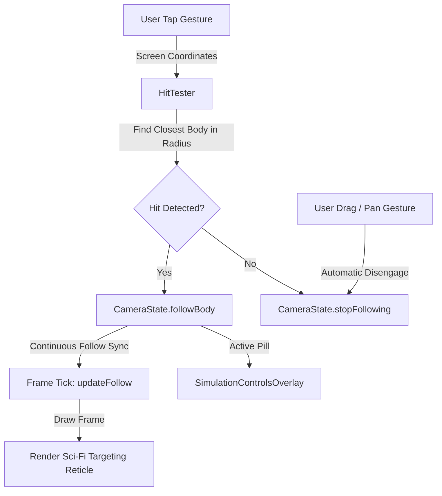

# Solar System Automata - Interactive Sandbox Log
**Branch**: `feature/interactive-sandbox`  
**Base**: `main` (Canvas rendering merged)  
**Status**: Completed & Verified  
**Tracked For**: Gemini Vibe Coding Sync  

---

## 1. Feature: Screen-Space Hit Testing, Target Reticle, and Camera Follow Mode
Allows users to tap any celestial body to lock the camera focal point onto it.

---

## 2. Invariants & Implementation Details

### A. Zero-Allocation Hit Testing (`HitTester.kt`)
- Projects each body's world coordinate to screen pixels using scalar functions:
  $$S_x = \text{worldToScreenX}(W_x), \quad S_y = \text{worldToScreenY}(W_y)$$
- Calculates effective hit radius using visual screen radius clamp and touch slop:
  $$R_{\text{effective}} = \max(\text{clamp}(R_{\text{world}} \cdot \text{zoom}, 3.5, 45.0), 36.0\,\text{px})$$
- Computes Euclidean distance squared $\Delta x^2 + \Delta y^2 \le R_{\text{effective}}^2$.
- Closest body wins in case of overlapping touch radiuses. Zero heap allocations.

### B. Camera Follow Mode (`CameraState.kt`)
- `followedBodyIndex: Int`: Tracked body index (-1 for unpinned free-camera).
- Synchronized inside `withFrameNanos` in `SimulationCanvas.kt` to ensure camera position is updated *before* the draw pass without mutating state inside `DrawScope`.
- Panning the screen (`panBy`) or fitting all bounds (`fitBounds`) automatically calls `stopFollowing()`, returning seamless manual control to the user.

### C. Sci-Fi Targeting Reticle (`SimulationCanvas.kt`)
- When in follow mode, draws:
  1. Outer glow halo ring (`reticleGlowPaint`).
  2. Sharp cyan inner targeting circle (`reticlePaint`).
  3. Four directional compass tick marks (`reticleCornerPaint`).
- All paint instances are pre-allocated in `SimulationPaintCache`.

### D. Overlay Follow Indicator (`SimulationControlsOverlay.kt`)
- Displays an animated glowing chip in the top HUD:
  `◉ FOLLOWING: <PLANET NAME>  [✕]`
- Clicking `✕` calls `cameraState.stopFollowing()`.

---

## 3. Unit Tests & Verification
- `HitTesterTest`:
  - `returnsNegativeOneOnEmptySnapshot`: Verified empty state safety.
  - `hitsBodyDirectlyAtCenter`: Verified direct center hit detection.
  - `hitsBodyWithinTouchSlop`: Verified slop detection.
  - `returnsNegativeOneWhenTapIsOutsideSlop`: Verified boundary miss.
  - `selectsClosestBodyWhenMultipleWithinTouchSlop`: Verified closest target resolution.
- `CameraStateTest`:
  - `followModeSyncsCameraCenterToFollowedBody`: Verified follow sync.
  - `panByDisengagesFollowMode`: Verified auto-disengage on manual drag.
  - `fitBoundsDisengagesFollowMode`: Verified auto-disengage on recenter.
  - `updateFollowDisengagesWhenBodyOutOfBounds`: Verified out-of-bounds safety.
- Test Run: `./gradlew test` -> `BUILD SUCCESSFUL`.
