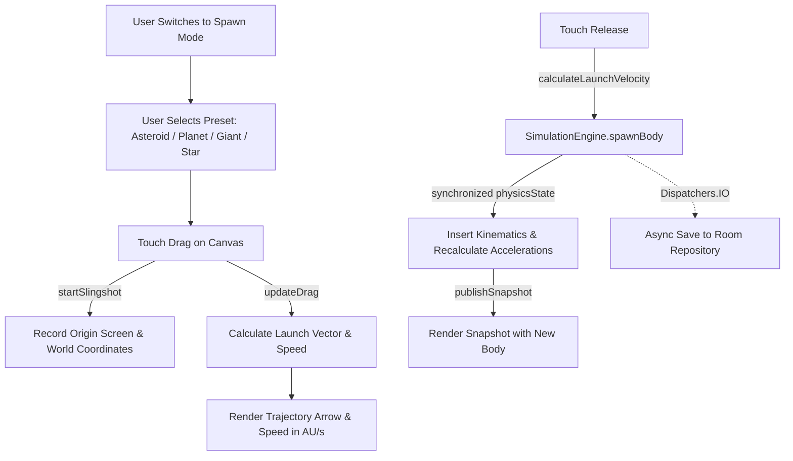

# Solar System Automata - Interactive Sandbox Log
**Branch**: `feature/interactive-sandbox`  
**Base**: `main` (Canvas rendering merged)  
**Status**: Milestone 1 (Slingshot Body Spawner) Completed & Verified  
**Tracked For**: Gemini Vibe Coding Sync  

---

## 1. Feature Map
1. **Screen-Space Hit Testing**: Tap celestial bodies using touch slop ($36\,\text{px}$) and closest-target resolution.
2. **Camera Follow Mode**: Locks viewport to a moving body; auto-disengages upon manual drag.
3. **Targeting Reticle**: Sci-fi cyan circle, outer glow, and compass tick marks on the tracked body.
4. **Slingshot Body Spawner (Milestone 1)**:
   - Toggle into `SPAWN` mode.
   - Choose body preset (*Asteroid*, *Planet*, *Gas Giant*, *Star*).
   - Drag backward on canvas to stretch slingshot trajectory.
   - Live trajectory vector arrow and speed readout.
   - Release to atomically inject the body into the active 64-bit gravitational physics simulation.



---

## 2. Mathematical Formulations & Invariants

### Slingshot Launch Velocity
Given origin screen point $(O_x, O_y)$ and current touch position $(D_x, D_y)$:
$$\Delta x_{\text{screen}} = D_x - O_x, \quad \Delta y_{\text{screen}} = D_y - O_y$$
$$\Delta x_{\text{world}} = \frac{\Delta x_{\text{screen}}}{\text{zoom}}, \quad \Delta y_{\text{world}} = \frac{\Delta y_{\text{screen}}}{\text{zoom}}$$
$$\vec{v}_{\text{launch}} = \left(-\Delta x_{\text{world}} \cdot \kappa, \; -\Delta y_{\text{world}} \cdot \kappa\right)$$
where $\kappa = 0.5$ is the calibrated velocity sensitivity constant.

### Slingshot Arrowhead Geometry
Let launch vector direction angle $\theta = \text{atan2}(-\Delta y, -\Delta x)$, arrowhead length $L = 20\,\text{px}$, and spread half-angle $\alpha = 30^\circ$:
$$\text{Head}_1 = \left(E_x - L \cos(\theta - \alpha), \; E_y - L \sin(\theta - \alpha)\right)$$
$$\text{Head}_2 = \left(E_x - L \cos(\theta + \alpha), \; E_y - L \sin(\theta + \alpha)\right)$$

### Thread-Safe Atomic Injection
```kotlin
synchronized(physicsState) {
    if (physicsState.count < capacity) {
        val i = physicsState.count
        physicsState.posX[i] = posX
        physicsState.posY[i] = posY
        physicsState.velX[i] = velX
        physicsState.velY[i] = velY
        physicsState.mass[i] = mass
        physicsState.radius[i] = radius
        physicsState.color[i] = color
        physicsState.names[i] = name
        physicsState.count = i + 1
        integrator.computeAccelerations(physicsState, g, softening)
        publishSnapshot()
    }
}
```

---

## 3. Unit Tests & Verification
- `SlingshotStateTest`:
  - `startSlingshotInitializesWorldAndScreenCoordinates`: PASSED.
  - `calculateLaunchVelocityIsOppositeToDragDirection`: PASSED.
  - `launchVelocityScalesWithCameraZoom`: PASSED.
  - `cancelResetsActiveState`: PASSED.
  - `spawnPresetsHaveCorrectAttributes`: PASSED.
  - `simulationEngineSpawnsBodyThreadSafely`: PASSED (verified atomic insertion and capacity bound enforcement).
- `HitTesterTest`: ALL 5 PASSED.
- `CameraStateTest`: ALL 8 PASSED.
- `OrbitalIntegratorTest`: ALL PASSED.
- `./gradlew test`: BUILD SUCCESSFUL.
- `./gradlew assembleDebug`: BUILD SUCCESSFUL.
