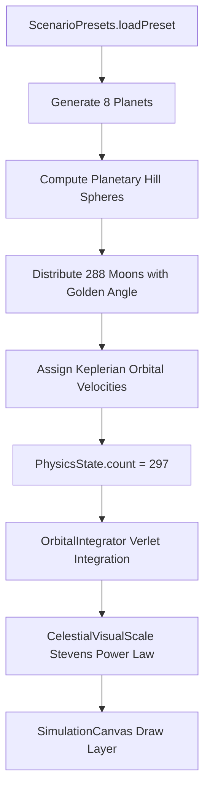

# Solar System Automata - Planetary Moons & Visual Scaling
**Branch**: `feature/planetary-moons`  
**Base Commit**: `93872d8` (Milestone 4 & Release Hardening merged into `main`)  
**Status**: Milestone 5 Completed & Merged  
**Tracked For**: Gemini Vibe Coding Sync  

---

## 1. Feature Map & Architectural Summary
1. **Full Natural Satellite System (288 Confirmed Moons, 297 Total Bodies)**:
   - Audited and added all 288 confirmed natural satellites across all 8 planets:
     - **Mercury & Venus**: 0 moons
     - **Earth**: 1 moon (Moon / Luna)
     - **Mars**: 2 moons (Phobos, Deimos)
     - **Jupiter**: 95 confirmed moons (Galilean: Io, Europa, Ganymede, Callisto, and irregular groups)
     - **Saturn**: 146 confirmed moons (Titan, Enceladus, Mimas, Iapetus, Rhea, Dione, Hyperion, Phoebe, etc.)
     - **Uranus**: 28 confirmed moons (Titania, Oberon, Umbriel, Ariel, Miranda, etc.)
     - **Neptune**: 16 confirmed moons (Triton, Proteus, Nereid, etc.)
   - Expanded `PhysicsState.DEFAULT_CAPACITY` from 64 to 512 bodies to accommodate large multi-body planetary systems.

2. **Continuous Stevens' Psychophysical Power-Law Visual Scaling (`CelestialVisualScale.kt`)**:
   - Solves the astronomical dynamic range problem: Jupiter ($R \approx 11.2\,R_\oplus$) vs Deimos ($R \approx 0.001\,R_\oplus$).
   - Replaced piecewise clamping with continuous power-law model calibrated to human perceptual thresholds:
     $$R_{\text{screen}} = 2.5 \cdot \left(\frac{R}{R_\oplus}\right)^{0.60} \cdot (\text{zoom})^{0.15} + 1.0\,\text{px}$$
   - Pre-calculates zoom factor once per frame to eliminate redundant `Math.pow` calculations in the hot render path.

3. **Hill Sphere Keplerian Orbit Distribution (`ScenarioPresets.kt`)**:
   - Moons are dynamically placed within each planet's gravitational Hill sphere:
     $$r_H = a_p \cdot \sqrt[3]{\frac{M_p}{3 M_\odot}}$$
   - Stable orbital bounds configured between $0.02\,r_H$ and $0.35\,r_H$ using golden-angle ($\phi \approx 137.5^\circ$) dispersion to prevent artificial collinear resonance.
   - Initial velocities computed via circular orbital velocity:
     $$v_{\text{orb}} = \sqrt{\frac{G \cdot M_p}{r}}$$

4. **N-Body Acceleration Inner Loop Register Hoisting (`OrbitalIntegrator.kt`)**:
   - Hoists `accX[i]` and `accY[i]` into local CPU registers inside the inner $O(N^2)$ acceleration loop, eliminating redundant array read-modify-write cycles across 297 bodies.

5. **Controls Polish & Time Warp (`SimulationControlsOverlay.kt`)**:
   - Continuous logarithmic time warp slider ranging from $0.25\times$ to $100\times$.
   - Streamlined HUD: removed obsolete spawn toggle and manual step buttons.
   - Sun-centered "Fit All" camera viewport action.
   - Selective label Level-of-Detail (LOD) and moon trail gating for smooth 60/120 FPS performance.

---

## 2. Mathematical Formulations & Invariants

### Stevens' Power-Law Screen Radius
$$R_{\text{screen}}(R, \text{zoom}) = 2.5 \cdot \left(\frac{R}{R_\oplus}\right)^{0.60} \cdot \text{zoom}^{0.15} + 1.0\,\text{px}$$

### Gravitational Hill Sphere
$$r_H = a_p \cdot \left(\frac{M_p}{3 M_\odot}\right)^{1/3}$$

### Stable Moon Radius Distribution
$$r_{\text{moon}, k} = r_{\min} + (r_{\max} - r_{\min}) \cdot \sqrt{\frac{k + 1}{N_{\text{moons}}}}$$
$$\theta_k = k \cdot 137.507764^\circ$$

---

## 3. Verification & Test Suite
- `SolarSystemMoonsTest`: Verifies full 297-body configuration, Hill sphere stability bounds, mass/radius positiveness, and 1,000-step numerical integration stability without NaN/Inf divergence.
- `CelestialVisualScaleTest`: Verifies sub-pixel clamping ($R \ge 1.0\,\text{px}$), monotonic scaling for all body classes, and pre-computed zoom factor consistency.
