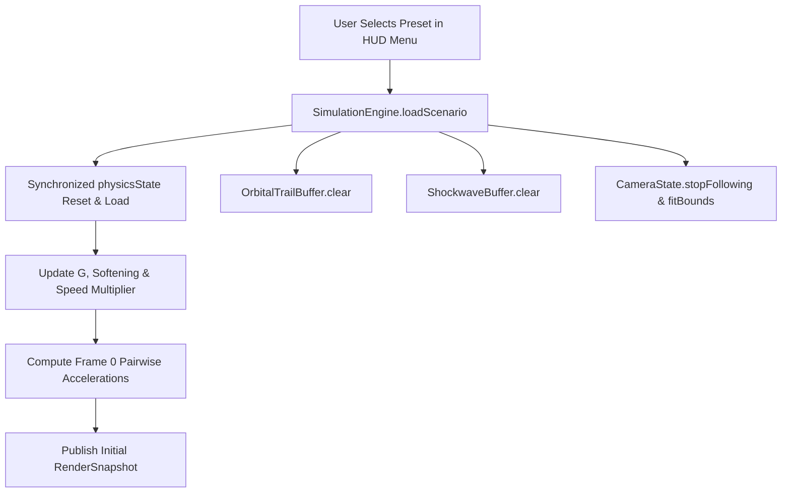

# Solar System Automata - Scenario Presets Switcher
**Branch**: `feature/scenario-presets`  
**Base Commit**: `51c615d` (Milestone 3 merged into `main`)  
**Status**: Milestone 2 Completed & Verified  
**Tracked For**: Gemini Vibe Coding Sync  

---

## 1. Feature Map & Architectural Summary
1. **Canonical Celestial Scenario Presets (`ScenarioPresets.kt`)**:
   - **Solar System (Default)**: Sun + 8 planets calibrated in Astronomical Units (AU) and Earth masses.
   - **Figure-8 Three-Body Choreography**: Moore (1993) / Chenciner-Montgomery (2000) three equal-mass solution tracing an unbroken figure-8 with zero net momentum ($\sum \vec{P} = \vec{0}$) and barycenter at $(0, 0)$.
   - **Binary Star with Circumbinary Planet**: Twin stars in mutual Keplerian orbit around $(0, 0)$ orbited by a stable distant Tatooine-like planet beyond dynamical instability boundaries ($R > 3 D$).
   - **Lagrange Points & Trojan Asteroids**: Primary star and orbiting gas giant forming stable $L_4$ (leading $60^\circ$) and $L_5$ (trailing $60^\circ$) gravitational equilibrium wells with test asteroids.
   - **Chaotic Three-Body System**: Burrau (1913) / Szebehely & Peters (1967) Pythagorean 3-4-5 mass ratio system placed at rest at the vertices of a right triangle to showcase chaotic multi-body slingshots and ejections.

2. **Zero-Allocation In-Place State Swap**:
   - `PhysicsState.reset()` zeroes out existing buffers in-place without triggering garbage collector allocations.
   - `SimulationEngine.loadScenario(preset)` synchronizes on `physicsState`, updates $G$ and softening factors, computes initial accelerations via `OrbitalIntegrator.computeAccelerations()`, and publishes frame 0 snapshot immediately.

3. **Buffer & Viewport Synchronization**:
   - `OrbitalTrailBuffer.clear()` flushes past orbital paths to prevent trail artifacts across scenarios.
   - `ShockwaveBuffer.clear()` flushes active shockwaves.
   - `CameraState.stopFollowing()` disengages follow mode.
   - `CameraState.fitBounds()` re-calculates the bounding box of the newly selected scenario and auto-fits the viewport with smooth padding.

4. **Interactive Glassmorphic Preset Switcher (`SimulationControlsOverlay.kt`)**:
   - Replaced static `GlassChip("SOLAR SYSTEM")` with an interactive button showing active emoji, title, accent border, and dropdown indicator.
   - Animated dropdown menu with glassmorphism card styling, displaying scenario titles, physical summaries, and active indicator badges.

---

## 2. Mathematical Formulations & Invariants

### Figure-8 Momentum Invariant
$$\sum_{i=1}^3 m_i \vec{v}_i = \vec{0}, \quad \sum_{i=1}^3 m_i \vec{r}_i = \vec{0}$$

### Binary Star Keplerian Velocity
$$v_{\text{bin}} = \sqrt{\frac{G \cdot M_{\text{star}}}{2 D}}, \quad v_{\text{planet}} = \sqrt{\frac{G \cdot 2 M_{\text{star}}}{R_{\text{planet}}}}$$

### Pythagorean 3-4-5 Triangle Center of Mass
$$X_{\text{cm}} = \frac{300(1) + 400(-2) + 500(1)}{1200} = 0, \quad Y_{\text{cm}} = \frac{300(3) + 400(-1) + 500(-1)}{1200} = 0$$

---

## 3. Test Suite & Verification Results
- `ScenarioPresetsTest`:
  - `testAllPresetsExistAndAreConfigured`: PASSED (all 5 presets verified).
  - `testFigureEight_conservesLinearMomentumAndBarycenter`: PASSED ($\vec{P} = \vec{0}$ and preserved over 200 integration steps).
  - `testBinaryStar_barycenterAndCentripetalVelocity`: PASSED.
  - `testLagrangePoints_equilateralTriangleGeometry`: PASSED ($L_4$ equilateral distances verified).
  - `testChaoticThreeBody_pythagoreanGeometryAndZeroInitialMomentum`: PASSED (3-4-5 sides, zero initial momentum, center of mass at origin).
  - `testPhysicsState_resetClearsBuffersInPlace`: PASSED.
  - `testSimulationEngine_loadScenarioUpdatesStateAndSnapshot`: PASSED.
- Pre-existing suites (`CollisionPhysicsTest`, `OrbitalIntegratorTest`, `SlingshotStateTest`, `HitTesterTest`, `CameraStateTest`): ALL PASSED.
- `./gradlew testDebugUnitTest`: BUILD SUCCESSFUL (29 tasks executed/cached).
- `./gradlew assembleDebug`: BUILD SUCCESSFUL.
